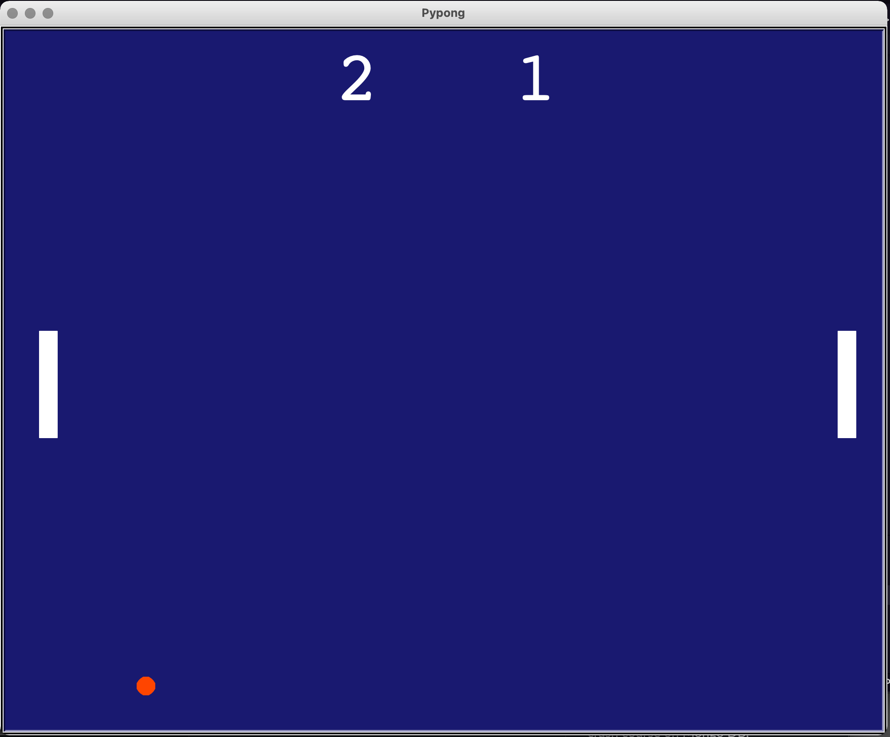
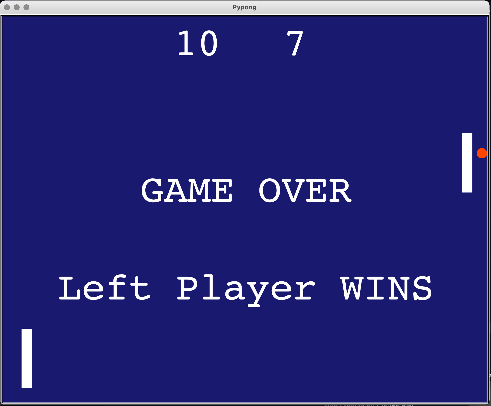

# Pypong
PyPong (Python + Pong = PyPong) is written in Python and uses the Turtle module to recreate the classic 'Pong' game.

## Controls
The game uses the 'Up' and 'Down' arrow keys on the keyboard to raise and lower the right paddle and the 'W' and 'S' keys to raise and lower the left paddle.

## Gameplay
The game itself is a two-player game. The object of the game is to reach 10 points by causing the ball to cross the boundary of the opposing player's side.

## Screenshot

## Roadmap
- Fix a bug that causes the ball to occasionally 'phase' through a paddle
- Fix a bug that causes the ball to occasionally bounce against a paddle a few times before traveling to the opposite side
- Add an AI component that allows for the computer to control one paddle
- Add sound effects
- Further design the background